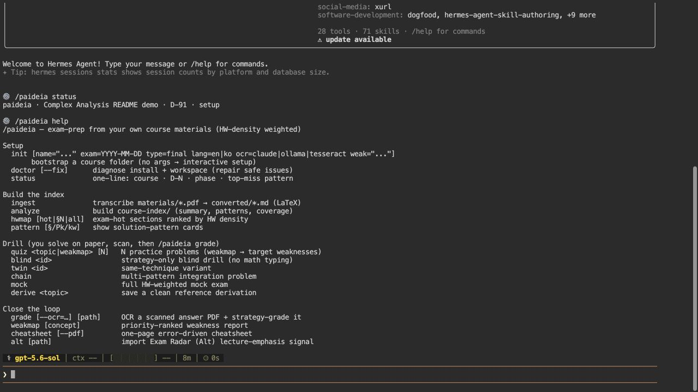
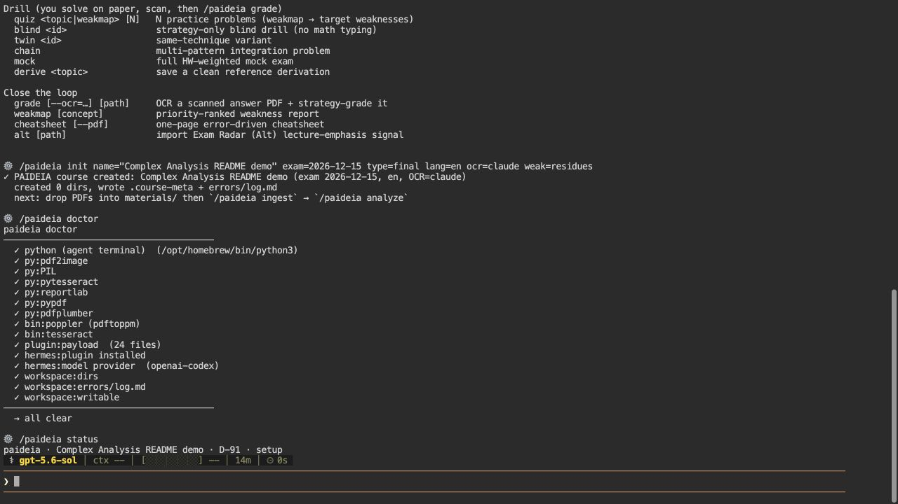
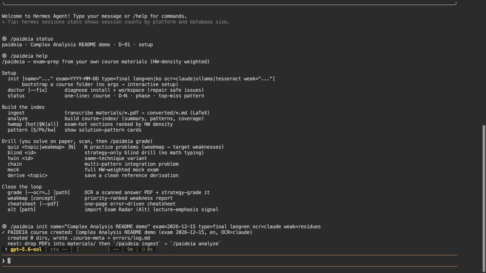
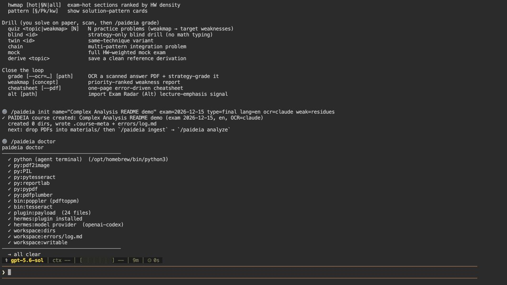

<h1 align="center">ΠΑΙΔΕΙΑ · Paideia <sub>for Hermes</sub></h1>

<p align="center">
  <strong>당신의 과목, 당신의 패턴, 당신의 오답, 당신의 치트시트.</strong><br>
  <em>당신의 자료에서 출발해 한 과목에 영속적으로 머무는 학습 그래프를 만드는 Hermes Agent 플러그인입니다 — 모든 산출물이 일반 실러버스가 아니라 당신의 손끝에서 빚어집니다.</em>
</p>

<p align="center">
  
  
  
  
  &nbsp;
  
  
  
  
  
  
  
  &nbsp;
  
  
</p>

<p align="center">
  <a href="https://news.hada.io/topic?id=29865"></a><a href="https://news.hada.io/weekly/202622"></a><br>
  <a href="https://www.producthunt.com/products/paideia"></a><a href="https://www.taewoopark.com/projects/paideia"></a>
  <br><sub>원본 PAIDEIA의 소개 기사와 인터랙티브 데모입니다.</sub>
</p>

<p align="center">
  <a href="./README.md">English README</a>
  &nbsp;·&nbsp;
  <a href="https://taewoopark.com"><strong>taewoopark.com</strong> — 저자 사이트</a>
</p>

<p align="center"><sub><strong>PAIDEIA 패밀리 — 하나의 학습 엔진, 모든 에이전트 런타임</strong></sub></p>

| 플랫폼 | 저장소 | 설명 |
|:--:|:--|:--|
| <a href="https://github.com/OPTIMETA/PAIDEIA"></a> | **[PAIDEIA](https://github.com/OPTIMETA/PAIDEIA)** | 원본 — **Claude Code** 플러그인. |
| <a href="https://github.com/OPTIMETA/PAIDEIA-codex"></a> | **[PAIDEIA-codex](https://github.com/OPTIMETA/PAIDEIA-codex)** | **OpenAI Codex** 스킬 + 번들 MCP 서버. |
| <a href="https://github.com/OPTIMETA/PAIDEIA-opencode"></a> | **[PAIDEIA-opencode](https://github.com/OPTIMETA/PAIDEIA-opencode)** | **opencode**를 구동하는 명령줄 프로그램. |
| <a href="https://github.com/OPTIMETA/PAIDEIA-Hermes"></a> | **[PAIDEIA-Hermes](https://github.com/OPTIMETA/PAIDEIA-Hermes)** | **Hermes Agent** 플러그인: CLI 명령 + 게이트웨이 라우팅. |
| <a href="https://github.com/OPTIMETA/PAIDEIA-mcp"></a> | **[PAIDEIA-mcp](https://github.com/OPTIMETA/PAIDEIA-mcp)** | 독립형 로컬 **MCP** 서버 — Alt 로컬 모델에서 PAIDEIA 구동. |
| <a href="https://github.com/OPTIMETA/PAIDEIA-Alt"></a> | **[PAIDEIA-Alt](https://github.com/OPTIMETA/PAIDEIA-Alt)** | **Exam Radar** — Alt 강의 캡처 플러그인 ([altalt.org](https://altalt.org)). |

<p align="center">
  <em>일반적인 학습 도구는 평균적인 실러버스를 가르칩니다. Paideia는 <strong>당신의</strong> 실러버스를 가르칩니다 —<br>
  당신의 교수님 강의노트, 당신의 숙제 경향, 당신의 필기, 당신의 오답에서 출발해서요. 모든 산출물은 당신이 직접 편집할 수 있는 마크다운 파일입니다.</em>
</p>

<p align="center">
  
</p>

---

## Paideia라는 이름에 대하여

고대 그리스에서 **Παιδεία(파이데이아)**는 수동적인 학생에게 지식을 채워 넣는 일이 아니었습니다. 원전과 마주하고, 스승 곁에서 익히고, 피드백을 더 깊은 고쳐 씀으로 되돌리는 대화를 거쳐 — 한 사람을 평생에 걸쳐 빚어 가는 일이었지요.

이 플러그인은 그 순환을 **수학·물리·공학 과목의 시험 준비**라는 좁고 분명한 문제에 맞춰 옮겨 놓았습니다.

```
  ingest ──▶ analyze ──▶ drill ──▶ grade ──▶ weakmap ──▶ cheatsheet
     ▲                                                        │
     └────────────────── feedback loop ───────────────────────┘
```

학습 단계의 산출물은 코스 폴더의 마크다운 파일로 남습니다. 에이전트와 별개로 계속 읽고, 편집하고, 버전 관리할 수 있습니다. 새로운 산출물을 생성할 때는 해당 단계의 실행 환경·도구·모델이 필요합니다.

---

## 일반적인 학습 도구가 하지 못하는 것

Paideia는 *당신*의 과목, *당신* 교수님의 과제, *당신*의 실수에서 출발합니다. 강의노트·교재 챕터·숙제·풀이·스캔 답안을 코스 폴더에 넣으면 그것이 학습의 기준이 됩니다.

일반 커리큘럼이나 직접 만든 플래시카드도 함께 사용할 수 있습니다. Paideia가 더하는 것은 풀이에서 반복 패턴을 추출하고, 숙제 밀도로 연습 우선순위를 정하고, 오답 기록을 다음 드릴에 반영하는 흐름입니다. 아래 표는 이 흐름의 차이를 설명하며, 개별 학습 서비스의 기능이나 요금제를 단정하지 않습니다.

| 축 | Paideia | 일반 강좌 또는 구조화하지 않은 채팅 |
|-----|---------|------------------------------|
| 풀이 패턴 (`P1..Pk`) | 내 과목의 풀이에서 추출하고 출처를 인용 | 과목 자료와 별도 지시가 필요 |
| 드릴 우선순위 | 교수님의 숙제 비중으로 가중 | 별도로 정하고 관리해야 함 |
| 치트시트 | 오답으로 주의점을 고르고 코스 인덱스에서 참조 내용을 가져옴 | 별도로 구성하고 갱신해야 함 |
| 세션을 넘는 과목 상태 | 코스 폴더의 마크다운 + 메타데이터 | 서비스와 맥락 제공 방식에 따라 다름 |
| 동의하지 않는 산출물 수정 | 에디터에서 `.md`를 열어 저장 | 도구의 편집·내보내기 지원에 따라 다름 |
| 다음 학기로 준비 자료 옮기기 | 코스 폴더를 복사하고 바뀐 자료를 수정 | 관련 자료와 이력을 옮겨야 함 |
| 이해의 변화 이력 | 파일을 커밋하면 `git log` / `git diff`로 확인 | 도구의 버전 관리 지원에 따라 다름 |
| 산출물의 위치 | 내 디스크의 텍스트 파일 | 서비스에 따라 다름 |

모델 작업은 실행 환경이 담당하고, 학습 그래프는 언제든 열고 읽고 수정하고 비교할 수 있는 파일로 남습니다. 제공자를 바꾸거나 구독을 중단해도 이미 만들어진 파일은 사라지지 않습니다.

기본 답안 OCR은 `claude`이며 실행 환경의 비전 경로로 페이지 이미지를 읽습니다. 로컬 답안 OCR을 쓰려면 Ollama와 `qwen3-vl:8b`를 설치한 뒤 `.course-meta`에 `OCR_ENGINE: ollama`로 지정하거나 grade에 `--ocr=ollama` 옵션을 붙이세요. 모델을 다운로드하는 것만으로 엔진이 바뀌지는 않습니다. `tesseract`도 로컬 선택지입니다. 로컬 OCR은 전사 단계를 기기 안에서 처리하며, 이후 분석·채점은 설정된 모델을 사용하므로 전사된 텍스트가 외부 모델에 전달될 수 있습니다.

---

## 핵심 원리: 숙제 밀도가 곧 출제 확률입니다

숙제는 Paideia가 시험 준비 시간을 배분하는 일차 신호입니다. 과제가 많이 배정된 절은 더 연습하고, 숙제가 없는 절은 기본적으로 참조 자료로 둡니다. **이 티어는 학습 우선순위이며, 통계적으로 측정한 출제 확률이나 실제 시험 범위에 대한 보장은 아닙니다.**

| 티어 | 해당 절의 숙제 수 | 처리 | 모의고사 배점 목표 |
|------|-------------------|------|--------------------|
| 🔥🔥 출제 핵심 | 3개 이상 | 가장 집중해서 연습 | ≥70% |
| 🔥 출제 유력 | 2개 | 다음 순서로 연습 | ~25% |
| 🟡 출제 가능 | 1개 | 가볍게 복습 | ≤5% |
| ⚪ 저위험 | 0개 | 기본적으로 참조용 | 기본 0 |

`/paideia quiz all`, `/paideia mock 90`, `/paideia hwmap hot`은 이 순위를 사용합니다. 배점은 문제를 생성하는 에이전트에 주는 지침이므로, 정확한 비율이 필요하면 생성된 모의고사를 확인하세요. 사용자의 요청과 Exam Radar로 가져온 강의 강조 신호도 복습 범위를 결정하는 데 참고할 수 있습니다.

---

## 형성 사이클, 단계별 해설

<p align="center"><sub><em>Mac에서 실제 실행한 CLI를 로컬 터미널 뷰어로 촬영했습니다. 코스 자료는 검증용으로 만든 작은 예제입니다.</em> · <a href="docs/media/README.md">촬영 조건</a></sub></p>
<table>
  <tr>
    <td align="center" width="50%">
      
      <br><sub><b><code>/paideia status</code></b> — course · D-N · phase</sub>
    </td>
    <td align="center" width="50%">
      
      <br><sub><b><code>/paideia help</code></b> — command reference</sub>
    </td>
  </tr>
  <tr>
    <td align="center" width="50%">
      
      <br><sub><b><code>/paideia init</code></b> — course setup</sub>
    </td>
    <td align="center" width="50%">
      
      <br><sub><b><code>/paideia doctor</code></b> — dependency check</sub>
    </td>
  </tr>
</table>

코스 폴더에서 Hermes를 열고 **`/paideia <서브커맨드>`**를 입력합니다. 하나의 슬래시 명령 아래 학습·설정 기능 17개와 `help`가 있습니다.

- `status`, `doctor`, `help`, `init name="…" exam=YYYY-MM-DD …`는 Python이 처리한 결과를 바로 반환합니다.
- 인자 없는 `init`은 대화형 설정을 에이전트에 맡깁니다. 학습 기능 14개(`ingest`, `analyze`, 드릴·채점·리포트·`alt`)는 에이전트 턴을 주입합니다. 처음 보이는 “에이전트에 전달했습니다”는 접수 표시이며, 산출물 생성 완료를 뜻하지 않습니다.
- 에이전트가 번들 명령 명세와 스킬을 읽고 현재 코스에 파일을 씁니다. blind 드릴의 전략 답변도 같은 대화에서 이어갑니다.
- PAIDEIA는 세션 시작 배너와 `/paideia status`를 제공합니다. 마크다운과 수식은 CLI 옆에 Obsidian을 열어 읽을 수 있습니다.

| 단계 | 하는 일 | 명령어 | 산출물 |
|-------|-------------|----------|----------|
| **만남** | 교수님의 신호를 읽는다 | `/paideia ingest` | `converted/**/*.md` — 강의·교재·숙제·풀이 전부를 깔끔한 LaTeX 마크다운으로 |
| **구조** | 과목의 문법을 뽑아낸다 | `/paideia analyze` | `course-index/{summary,patterns,coverage}.md` — 토픽 트리, 반복 패턴(P1..Pk), 숙제 밀도 출제 티어 |
| **연습** | 교수님이 실제로 내는 곳에 가중한 능동 회상 | `/paideia quiz`·`twin`·`blind`·`chain`·`mock` | `quizzes/`·`twins/`·`chain/`·`mock/` — 종이에 푸는 문제 |
| **성찰** | 손으로 쓴 풀이가 채점이 된다 | `/paideia grade` | `answers/converted/<name>.md` + `errors/log.md` — 에이전트 비전(기본)·Ollama·Tesseract로 OCR한 뒤 전략 채점 |
| **진단** | 오류를 우선순위 약점 리포트로 압축 | `/paideia weakmap` | `weakmap/weakmap_<ts>.md` — 덮어쓰지 않고 쌓이는 기록 |
| **증류** | 한 장으로, 오류에서 길어 올려, 인쇄까지 | `/paideia cheatsheet`·`derive`·`pattern` | `cheatsheet/final.md`, `derivations/<slug>.md` |

거드는 명령으로, `/paideia hwmap`은 숙제 밀도 출제 확률을 보여 주고, `/paideia status`는 지금 사이클 어디인지 알려 주며, `/paideia init`은 새 과목 폴더를 깔아 줍니다.

### Slack과 다른 메시징 게이트웨이

플러그인은 `pre_gateway_dispatch`도 등록합니다. 설정된 Hermes 게이트웨이에서 `!paideia quiz §1.2 3`(Slack·Matrix), `/paideia quiz §1.2 3`, `paideia quiz §1.2 3` 같은 메시지를 같은 학습 프롬프트로 바꿉니다. 이 재작성은 **모델을 사용하는 학습 기능 14개에만** 적용됩니다.

`status`, `doctor`, `help`, `init`은 호스트의 플러그인 명령 처리기로 넘어갑니다. 여기서는 `init name="…" exam=…`처럼 값을 명시하세요. 인자 없는 마법사는 CLI의 `inject_message()`에 의존하므로 게이트웨이에서는 마법사를 시작하지 않고 프롬프트 텍스트를 반환할 수 있습니다. 해당 플랫폼에서 호스트가 플러그인 명령을 노출하는지도 영향을 줍니다.

코스 경로는 게이트웨이가 실행되는 컴퓨터의 경로입니다. 에이전트 프롬프트는 에이전트 작업 디렉터리를 사용하고, 즉시 실행되는 Python 명령과 배너는 Hermes 프로세스의 `Path.cwd()`를 사용합니다. 원하는 코스 폴더에서 게이트웨이를 시작하고 `terminal.cwd`도 같은 경로로 맞추세요. `terminal.cwd`만 바꾸면 Python 명령의 경로는 바뀌지 않습니다. 스캔 파일도 서버 쪽 코스 폴더에 넣어야 합니다. README 이미지는 CLI 실행 화면이며, 실제 Slack 배포 화면은 아닙니다.

---

## 설치

### 사전 준비

**필수**

- [hermes-agent](https://github.com/NousResearch/hermes-agent), provider는 무엇이든(Nous Portal, OpenAI/Codex, Anthropic, OpenRouter, 로컬 …).
- Python 3.10+ (plugin syntax; the host may require newer) + Unix 계열 셸(`bash`/`zsh`; Windows는 WSL2).
- `poppler`(`pdftoppm`) — OCR 모든 티어가 씁니다.
  - **macOS**: `brew install poppler tesseract tesseract-lang`
  - **Linux**: `apt-get install poppler-utils tesseract-ocr tesseract-ocr-kor`
- Python 라이브러리: `pip install pdf2image pillow pytesseract reportlab pypdf pdfplumber`. 이 중 실제로 없으면 안 되는 건 `pdf2image`와 `pillow` 둘뿐입니다. OCR은 어느 티어든 PDF를 이미지로 굽는 데서 시작하니까요. `/paideia doctor`도 그 둘만 실패로 잡고, 나머지는 각각 어느 명령에 쓰이는지 적어서 경고로만 띄웁니다(`pytesseract` → tesseract 티어, `reportlab` → `cheatsheet --pdf`, `pypdf`·`pdfplumber` → 그때그때 하는 PDF 작업).

**선택 — `--ocr=ollama` 쓸 때만(페이지 이미지가 기기에 머묾)**

- `ollama` + `qwen3-vl:8b`(약 6 GB). `ollama pull qwen3-vl:8b`.

언제든 `/paideia doctor`로 위 항목을 점검하세요(`/paideia doctor --fix`는 권한 없이 고칠 수 있는 것만 손봅니다). 에이전트의 `terminal`이 실제로 쓰는 바로 그 `python3`를 검사하므로, 정말 돌릴 수 있는지를 있는 그대로 알려 줍니다.

### 플러그인 설치

```bash
hermes plugins install OPTIMETA/PAIDEIA-Hermes
hermes plugins enable paideia
```

hermes를 다시 띄우면 모든 세션에서 `/paideia`가 보입니다. 다른 방법도 있습니다.

```bash
# B) 유저 플러그인 폴더에 바로 clone
git clone https://github.com/OPTIMETA/PAIDEIA-Hermes ~/.hermes/plugins/paideia
hermes plugins enable paideia

# C) 개발·로컬 체크아웃 (심링크 — 고친 내용이 다음 세션에 바로 반영)
git clone https://github.com/OPTIMETA/PAIDEIA-Hermes && ./PAIDEIA-Hermes/install.sh
```

`hermes plugins enable paideia`는 활성 Hermes 프로필에 활성화 설정을 저장합니다. 해당 프로필의 plugins 폴더에서 플러그인을 찾으며, `HERMES_HOME`으로 별도 프로필을 선택할 수 있습니다.

### 과목별 부트스트랩

이번 과목에 쓸 폴더 안에서 hermes를 열고, 마법사를 돌리거나

```
/paideia init
```

…한 줄로 비대화식으로 깔아도 됩니다.

```
/paideia init name="복소해석 MATH 405" exam=2026-12-15 type=final lang=ko ocr=claude weak="등각적분"
```

어느 쪽이든 받는 항목은 같습니다. 인터페이스 언어 `en|ko`와 `COURSE_NAME`·`EXAM_DATE`·`EXAM_TYPE`·`USER_WEAK_ZONES`, 그리고 OCR 엔진이고요. 뒷일도 같은 코드가 처리합니다. 디렉터리 골격, `.course-meta`, 과목용 `PAIDEIA.md`, 보관된 스캔과 OCR 임시물을 제외하는 `.gitignore`, 그리고 깔아 둔 `errors/log.md`까지요. `exam=` 날짜가 형식에 안 맞으면 만들지 않고 거절합니다. D-N이 끝내 안 뜨는 과목 폴더를 받아 봐야 눈치챌 방법이 없으니까요.

폴더 생성 자체는 Git을 초기화하지 않습니다. 버전 이력을 원하면 `git init` 후 파일을 커밋하고, 활성 답안 스캔도 제외하려면 `answers/*.pdf` 규칙을 추가하세요. init을 다시 실행하면 `.course-meta`를 갱신하고 기존 `PAIDEIA.md`와 오답 이력은 보존합니다.

의존성 점검은 마법사 쪽에서만 먼저 돕니다. 한 줄로 만들었다면 `/paideia doctor`를 직접 한 번 돌려 주세요. 채점 한 번만 엔진을 바꾸려면 `/paideia grade --ocr=claude path/to/answer.pdf`처럼 덮어쓰세요.

---

## 코스 폴더 구조

`/paideia init` 직후 폴더 모양은 이렇습니다.

```
my-course/
├── .course-meta                     # 과목명, 시험일, 인터페이스 언어(en|ko), OCR 엔진
│                                    #   한 줄에 KEY: value 하나, 직접 고쳐도 된다.
│                                    #   `# 주석`은 앞에 공백 두 칸이 있어야 주석이라
│                                    #   `Complex Analysis #2`는 그대로 과목명이 된다
├── PAIDEIA.md                       # 에이전트가 읽는 과목별 워크플로 메모
├── .gitignore                       # 보관 스캔·OCR 임시물 제외; 활성 답안 PDF는 별도 규칙 필요
│
├── materials/                       # 원본을 여기에 둔다 (PDF/MD)
│   ├── lectures/  textbook/  homework/  solutions/
├── converted/                       # 생성 마크다운 — 재변환 전에 편집 내용 보존 (/paideia ingest 결과)
│   ├── lectures/  textbook/  homework/  solutions/
├── course-index/                    # 지식 베이스 — /paideia analyze 가 만든다
│   ├── summary.md  patterns.md  coverage.md  radar.md
├── answers/                         # 손글씨 스캔 PDF를 여기에 둔다
│   └── converted/                   # /paideia grade 가 OCR 마크다운을 쓰는 곳
├── errors/log.md                    # 쌓이기만 하는 YAML 오류 로그 (/weakmap·/cheatsheet 의 씨앗)
├── quizzes/  mock/  twins/  chain/  derivations/  cheatsheet/  weakmap/
```

원본은 `materials/`, 답안 스캔은 `answers/`에 넣으세요. 마크다운 산출물은 모두 편집할 수 있지만 재생성으로 덮어쓸 수 있으니 보존할 수정은 커밋하세요. `errors/log.md`와 weakmap 이력은 원본 PDF만으로 복구할 수 없는 개인의 시도 기록이므로 보관해야 합니다. 에디션별 컨텍스트 파일과 OCR 엔진 이름은 다르니 FAQ의 코스 이동 안내를 확인하세요.

---

## 읽기 팁: Obsidian을 쓰세요

Paideia는 모든 것을 LaTeX 수식(`$...$`, `$$...$$`)이 섞인 평범한 마크다운으로 씁니다. 아무 에디터로나 읽히지만, **[Obsidian](https://obsidian.md)**이 제일 잘 맞습니다. 설정 없이 MathJax로 수식을 렌더링하고, 백링크로 `quizzes/`에서 인용한 `converted/lectures/`로 바로 건너뛰며, 과목 폴더 전체를 검색되는 그래프 vault로 다룹니다. 로컬 파일을 오프라인으로 읽는 데 잘 맞습니다. 터미널은 수식에 약하니 거기서 싸우지 마세요.

---

## 강의를 담는 쪽: Alt

Obsidian이 읽는 쪽 짝이라면, **[Alt](https://www.altalt.io/ko/)**는 강의가 들어오는 반대쪽 짝입니다. Alt가 강의를 녹음·전사하고, 그 안에서 OPTIMETA의 **Exam Radar** 플러그인이 교수님이 입으로 얼마나 강조했는지로 토픽을 매깁니다. 그걸 `/paideia alt`로 Paideia에 넣으면 고리가 닫힙니다. **강의를 듣고 → 담고 → 시험 신호를 뽑고 → 중요한 것만 공부한다**, 이렇게요.

---

## 전체 워크플로우 — 예시

### Phase 0 — 코스당 한 번 (15분)

```bash
cp ~/textbooks/ch*.pdf      ~/courses/my-course/materials/textbook/
cp ~/lecture-notes/wk*.pdf  ~/courses/my-course/materials/lectures/
cp ~/hw/hw*.pdf             ~/courses/my-course/materials/homework/
cp ~/hw/hw*_sol.pdf         ~/courses/my-course/materials/solutions/
```

Hermes에서:

```
/paideia ingest                     # 모든 PDF → 비전 파이프라인 (병렬 에이전트, LaTeX 충실)
/paideia analyze <약점 힌트>        # 패턴 + 커버리지 + 요약 생성
/paideia hwmap hot                  # 🔥🔥 exam-primary 영역 띄우기
```

### Phase 1 — 진단 (40분)

```
/paideia quiz all 20                # 광범위 진단, 20문항
# 종이에 풀고 (40분), answers/diagnostic.pdf로 스캔
/paideia grade                      # 선택한 OCR 엔진 + 전략 채점
```

### Phase 2 — 타겟 드릴링 (준비 시간의 대부분)

```
/paideia weakmap                    # 우선순위 약점 리포트
/paideia blind hw3-p2               # 이미 풀어 본 문제의 전략만 점검
/paideia twin hw3-p2                # 같은 패턴, 새로운 표면의 변형 문제
/paideia chain 3                    # 3개 패턴이 결합된 통합 문제
/paideia quiz weakmap 5             # 최신 weakmap을 겨냥한 5문항
```

### Phase 3 — 통합 (약 90분)

```
/paideia mock 90                    # 숙제 밀도로 가중된 90분 모의고사
# 종이에 풀고 answers/mock_<ts>.pdf로 스캔
/paideia grade                      # 모의고사 채점
```

### Phase 4 — 압축 (60분, 시험 전날 밤)

```
/paideia cheatsheet --pdf           # 오류에서 출발한 한 장짜리 치트시트
/paideia weakmap                    # 약점 구역을 한 번 더 훑기
```

### Phase 5 — 쿨다운 (시험 10분 전)

```
/paideia weakmap                    # 상위 3개만. 새로운 것을 배우지는 마세요.
```

---

## 명령어 (총 17개)

이 목록은 이 에디션의 실제 제공 기능입니다. 원본의 `reindex` 또는 `graph` 명령은 포함하지 않습니다.

`/paideia <서브커맨드> [인자]` — 목록은 `/paideia help`로 바로 봅니다.

| 명령어 | 하는 일 |
|---------|---------|
| `/paideia init [name=… exam=… …]` | 새 과목 폴더 부트스트랩(마법사, 또는 인자 한 줄) |
| `/paideia doctor [--fix]` | 설치·워크스페이스 진단; `--fix`는 권한 없이 고칠 것만 손봄 |
| `/paideia status` | 한 줄 `과목 · D-N · 단계 · 최다 실수 패턴` |
| `/paideia ingest [--force]` | `materials/**`의 PDF → `converted/**` 마크다운(PDF당 서브에이전트) |
| `/paideia analyze [힌트]` | `course-index/{summary,patterns,coverage}.md` 구축 |
| `/paideia hwmap hot\|<§>` | 숙제 밀도순 🔥🔥 출제 핵심 섹션 |
| `/paideia pattern <§\|Pk\|키워드>` | course-index의 패턴 카드 |
| `/paideia derive <대상>` | `derivations/<slug>.md`에 깔끔한 참조 유도 |
| `/paideia quiz <주제\|§\|weakmap> [N]` | 연습문제 N개, 정답은 `_answers.md`에 숨김 |
| `/paideia blind <problem-id>` | 알려진 문제의 전략만 점검하는 드릴 |
| `/paideia twin <problem-id>` | 같은 패턴, 새 표면의 변형 |
| `/paideia chain <N>` | 패턴 N개를 엮은 통합 문제 |
| `/paideia mock <분>` | 숙제 밀도로 가중한 모의고사 |
| `/paideia grade [--ocr=<엔진>] [경로]` | 답안 PDF OCR + 전략 채점 + `errors/log.md` 기록 |
| `/paideia weakmap [개념]` | 우선순위 약점 리포트 → `weakmap/weakmap_<ts>.md` |
| `/paideia cheatsheet [--pdf]` | 오류에서 길어 올린 한 장 |
| `/paideia alt [붙여넣기]` | OPTIMETA Exam Radar(Alt) export 가져오기 → `radar.md` + `coverage.md` 강의 강조 열 |

---

## 내부 구조

### 인제스트 파이프라인: 모든 PDF를 비전으로

PDF는 페이지 이미지로 렌더링한 뒤 전사하고, 마크다운 원본은 출처 헤더를 붙여 복사합니다. ingest가 변환 자료를 쓰고, analyze가 이를 읽어 `summary.md`, `patterns.md`, `coverage.md`를 만듭니다.

`pd_render.py`는 ingest 시 한 페이지씩 160 dpi로 렌더링하고 긴 변을 1800 px 이하로 제한합니다. 명령 명세는 PDF당 에이전트 하나를 위임하고 각 페이지를 순서대로 읽도록 지시합니다. 이 흐름의 실행 가능 여부는 선택한 모델과 도구 설정에 달려 있습니다.

**ingest는 항상 에이전트 비전 명세를 따릅니다.** 아래 `OCR_ENGINE` 선택은 답안 채점에 적용됩니다. `ollama`를 선택해도 `/paideia ingest`가 로컬 OCR로 바뀌지는 않습니다. 마크다운 원본에는 이미지 인식이 필요하지 않습니다.

### 필기 OCR: 세 가지 엔진 중에서 직접 고르실 수 있습니다

종이에 풀고 `answers/`에 스캔을 넣은 다음 `/paideia grade`를 실행합니다. 엔진은 코스별로 고르고 `--ocr=<engine>`으로 호출별 변경이 가능합니다.

| 엔진 | 기본값? | 동작 방식 | 선택 시점 |
|------|---------|-----------|-----------|
| `claude` | 예 | 페이지를 렌더링한 뒤 에이전트의 비전 경로로 읽음 | 비전 모델·도구가 정상 설정되어 있을 때 |
| `ollama` | 선택 | 로컬 Ollama `qwen3-vl:8b`, Tesseract 폴백 포함 | 답안 OCR의 페이지 이미지를 로컬에서 처리할 때 |
| `tesseract` | 선택 | 로컬 `pytesseract` | 타이핑된 스캔. 필기·수식은 꼼꼼한 확인 필요 |

기본 답안 OCR은 `claude`이며 실행 환경의 비전 경로로 페이지 이미지를 읽습니다. 로컬 답안 OCR을 쓰려면 Ollama와 `qwen3-vl:8b`를 설치한 뒤 `.course-meta`에 `OCR_ENGINE: ollama`로 지정하거나 grade에 `--ocr=ollama` 옵션을 붙이세요. 모델을 다운로드하는 것만으로 엔진이 바뀌지는 않습니다. `tesseract`도 로컬 선택지입니다. 로컬 OCR은 전사 단계를 기기 안에서 처리하며, 이후 분석·채점은 설정된 모델을 사용하므로 전사된 텍스트가 외부 모델에 전달될 수 있습니다.

`claude`는 이 포트가 유지한 기존 엔진 이름입니다. Hermes 에이전트의 비전 흐름을 뜻하며 Anthropic을 선택하거나 설정된 모델을 바꾸지 않습니다. `pd_vision_ocr.py`는 로컬 OCR만 구현하고, 네이티브 비전은 명령 명세가 처리합니다.

### 라인 단위가 아닌, 전략 기반 채점

채점 지침은 (1) 선택한 패턴 `Pk`, (2) 변수·치환·기저·경로, (3) 최종 식의 형태를 봅니다. OCR이 불확실하면 전사와 채점 결과를 확인하세요. 오류는 `problem_id`, `pattern`, `error_type`, `summary`, `source`, `date` 필드로 `errors/log.md`에 추가합니다. 오류 유형은 `pattern-missed`, `wrong-variable`, `wrong-end-form`, `algebraic`, `sign`, `definition`입니다.

치트시트는 코스 인덱스와 오답 이력을 함께 사용합니다. 패턴·공식은 참조 내용을 제공하고, 오답은 주의점과 교정 항목을 결정합니다. `--pdf`는 인쇄용 `cheatsheet/final.pdf`도 요청합니다. 인쇄 전 렌더링된 수식을 확인하세요.

### *당신의* 풀이에서 추출된 패턴

`/paideia analyze`는 과목의 풀이와 예제를 읽어 반복되는 접근법을 `P1`, `P2`, …로 붙이고 `converted/`의 출처를 인용합니다. 패턴 카드와 숙제 커버리지가 이후 드릴의 맥락이 됩니다. 모델이 만든 인덱스는 실제 과제와 대조해 확인할 수 있습니다.

### Append-only 이력

명령은 `errors/log.md`에 시도를 추가하고 `weakmap/`에 날짜가 붙은 리포트를 저장합니다. 재변환하거나 에디션을 옮길 때 이 이력을 보존하세요. 문제지와 정답·풀이 파일은 별도로 생성되므로 먼저 문제를 풀고 해답을 여세요.

### 상태와 세션 배너

`/paideia status`는 코스 · D-N · 단계 · 최다 실수를 보여 줍니다. `patterns.md`가 없으면 `setup`, 패턴은 있지만 퀴즈 문제와 인식되는 오답 항목이 함께 있지 않으면 `diag`, 둘 다 있으면 `drill`, 모의고사 출처 기록이 인식되면 `mock`, `cheatsheet/final.md`나 `.pdf`가 있으면 `cram`, 시험 당일이면 `cool`입니다. 최신 weakmap의 첫 패턴을 우선하고 없으면 오답 로그의 빈도로 판단합니다. 이는 파일 기반 추정이며 숙련도의 증명은 아닙니다.

Hermes는 `on_session_start` 배너도 등록합니다. 코스 밖에서는 이 훅이 조용히 종료하지만 `/paideia status`를 직접 실행하면 초기화 안내를 반환합니다.

---

## 배포물

```
PAIDEIA-Hermes/                     # == ~/.hermes/plugins/paideia/
├── plugin.yaml  __init__.py        # 매니페스트 + register(ctx)
├── pd_meta.py  pd_workspace.py  pd_errlog.py  pd_weakmap.py    # 결정형 엔진
├── pd_status.py  pd_banner.py  pd_doctor.py             # 상태 · 배너 · 진단
├── pd_render.py  pd_vision_ocr.py                # PDF→PNG + 오프라인 OCR (단독 실행)
├── pd_prompts.py  pd_commands.py                 # inject 프롬프트 + /paideia 디스패처
├── tests/                          # 표준 라이브러리만 쓰는 회귀 테스트 — ./tests/run.sh
├── commands/                       # 에이전트용 명령 스펙 15개(.md)
├── skills/paideia-{pdf,vision-ocr,course-builder,exam-drill,answer-processing,alt-import}/
└── install.sh  LICENSE  CHANGELOG.md  README.md  README.ko.md
```

패치를 보내기 전에 테스트를 돌려 주세요. 설치 과정도, pytest도, venv도 필요 없습니다.

```bash
./tests/run.sh          # 98개, 실행 시간은 환경에 따라 다름
```

결정형 엔진을 처음부터 끝까지 훑고, 조용히 어긋나기 쉬운 파일 간 약속도 함께 붙잡아 둡니다. `pd_doctor.py`는 단독 실행을 위해 디렉터리 골격·메타 키·오류 로그 시드를 일부러 따로 들고 있고, 모든 LLM 서브커맨드는 명령 스펙과 실제로 존재하는 스킬을 둘 다 갖고 있어야 합니다.

이 중 넷은 퍼징을 돌려 `errors/log.md`가 계속 유효한 YAML인지 봅니다. YAML 파서가 있어야 하는 검사라, 없으면 건너뛰고 `OK (skipped=4)`로 끝납니다. `pd_errlog.py`를 건드리신다면 `pip install pyyaml`을 먼저 해 주세요. 안 그러면 그 `OK`가 보이는 것보다 헐겁습니다.

hermes 확장 표면으로의 매핑은 이렇습니다.

| PAIDEIA (Claude Code) | PAIDEIA-Hermes (hermes-agent) |
|---|---|
| `/paideia:*` 네임스페이스 명령 | 단일 `/paideia` + 서브커맨드 분기(`ctx.register_command`) |
| 자동 로드 skills | `skills/paideia-*/SKILL.md`, inject 프롬프트가 절대경로로 읽음 |
| 명령 `.md`를 직접 실행 | 핸들러의 `inject_message()`(CLI) / `pre_gateway_dispatch` 재작성(Slack 등) |
| `SessionStart` 훅 | `on_session_start` 훅 |
| `statusLine` 훅 | `/paideia status` + 세션 배너 |
| 병렬 ingest 에이전트 | hermes 서브에이전트 위임(PDF당 하나) |
| 과목별 `CLAUDE.md` | 과목별 `PAIDEIA.md` |

---

## 설계 원칙

1. **수식은 마크다운으로 읽습니다.** Obsidian이나 마크다운을 보여 주는 데스크톱 화면에서 코스를 여세요.
2. **풀이는 종이에 씁니다.** 답안을 스캔하고 환경에 맞는 OCR 경로를 고릅니다.
3. **전략과 전사를 확인합니다.** 패턴·변수·최종 형태로 채점하며 OCR과 모델 판단은 교정할 수 있습니다.
4. **내 과목에서 패턴을 뽑습니다.** 제공한 풀이와 예제를 출처로 인용합니다.
5. **기록한 오답에서 배웁니다.** 연습과 치트시트의 주의점에 반영합니다.
6. **숙제로 우선순위를 정합니다.** 밀도를 학습 신호로 삼고 공지된 시험 범위와 대조합니다.
7. **학습 그래프를 직접 소유합니다.** 편집 가능한 마크다운, 보존한 오답 이력, 세션을 넘는 버전 관리입니다.

---

## FAQ

**수학 과목이 아닌 경우에도 쓸 수 있나요?**
인제스트와 요약은 활용할 수 있지만 연습 과정은 반복되는 문제 풀이 패턴을 전제합니다. 수학·물리·공학 등 정량 과목을 중심으로 설계되었습니다.

**다음 세션은 제 작업을 어떻게 기억하나요?**
코스 컨텍스트·인덱스·오답 이력이 파일로 남고 다음 명령이 다시 읽습니다. 학습 기록을 대화 이력에만 의존하지 않습니다.

**패턴이나 치트시트를 직접 수정해도 되나요?**
네. 마크다운 에디터에서 저장하고 재생성 전에 보존할 파일을 커밋하세요. 오답 로그와 weakmap 이력은 따로 유지해야 합니다.

**한국어·영어가 섞인 자료도 되나요?**
`.course-meta`의 `INTERFACE_LANG: en` 또는 `ko`로 생성 설명의 언어를 고릅니다. 파일 경로·패턴 ID·YAML 키·티어 토큰은 유지됩니다. 로컬 OCR 스크립트는 이에 맞는 Tesseract 언어 설정을 사용하므로 필요한 언어팩을 설치하세요.

**Ollama가 꼭 필요한가요? 전체 과정이 오프라인인가요?**
Ollama는 선택 사항이며 기본값은 실행 환경의 비전 경로입니다. 로컬 OCR은 이미지 전사를 기기에서 처리하지만 분석·채점은 설정된 모델을 사용합니다. 엔진별 준비 사항은 위 OCR 표를 참고하세요.

**PAIDEIA 에디션 사이에 코스를 옮길 수 있나요?**
마크다운 학습 산출물은 폴더 구조를 공유합니다. 먼저 대상 에디션의 컨텍스트 파일(`CLAUDE.md` / `AGENTS.md` / `PAIDEIA.md`)과 엔진 이름(`claude` / `codex-native` / `vision`, `ollama` / `qwen3-vl`)을 확인하세요. 기존 메타데이터와 개인 이력을 보존해야 하며, 설정과 명령 목록까지 같지는 않습니다.

**모델이 생성한 채점은 확인이 필요한가요?**
네. 원본 스캔·전사·참조 패턴·YAML 로그를 대조해 확인하고 고칠 수 있습니다. 상태 표시는 파일에 따른 진행 안내이며 이해도를 독립적으로 측정한 결과는 아닙니다.

---

## 연락

<p align="center">
  <a href="https://github.com/TaewoooPark"></a>
  <a href="https://x.com/theoverstrcture"></a>
  <a href="https://www.linkedin.com/in/taewoo-park-427a05352"></a>
  <a href="https://www.instagram.com/t.wo0_x/"></a>
  <a href="mailto:ptw151125@kaist.ac.kr"></a>
</p>

---

## 라이선스

**MIT.** PAIDEIA-Hermes는 [OPTIMETA/PAIDEIA](https://github.com/OPTIMETA/PAIDEIA)의 hermes-agent 포트로, 같은 라이선스와 저작권(© 2026 Taewoo Park)을 그대로 따릅니다 — [`LICENSE`](./LICENSE)를 보세요. 자유롭게 쓰고, 당신 과목에 맞게 포크해 고치세요. 이 플러그인이 만드는 학습 그래프는 감수해야 할 고정 제품이 아니라, 당신이 빚어 가는 것 — 그게 핵심입니다.

크레딧: 원본 [PAIDEIA](https://github.com/OPTIMETA/PAIDEIA)(Claude Code), 그리고 토대가 된 [NousResearch/hermes-agent](https://github.com/NousResearch/hermes-agent)(MIT).

---

<p align="center">
  <em>범용 커리큘럼은 평균적인 학생을 가르친다. Παιδεία — 한 번에 한 사람씩, 빚어내는 일.</em>
</p>
